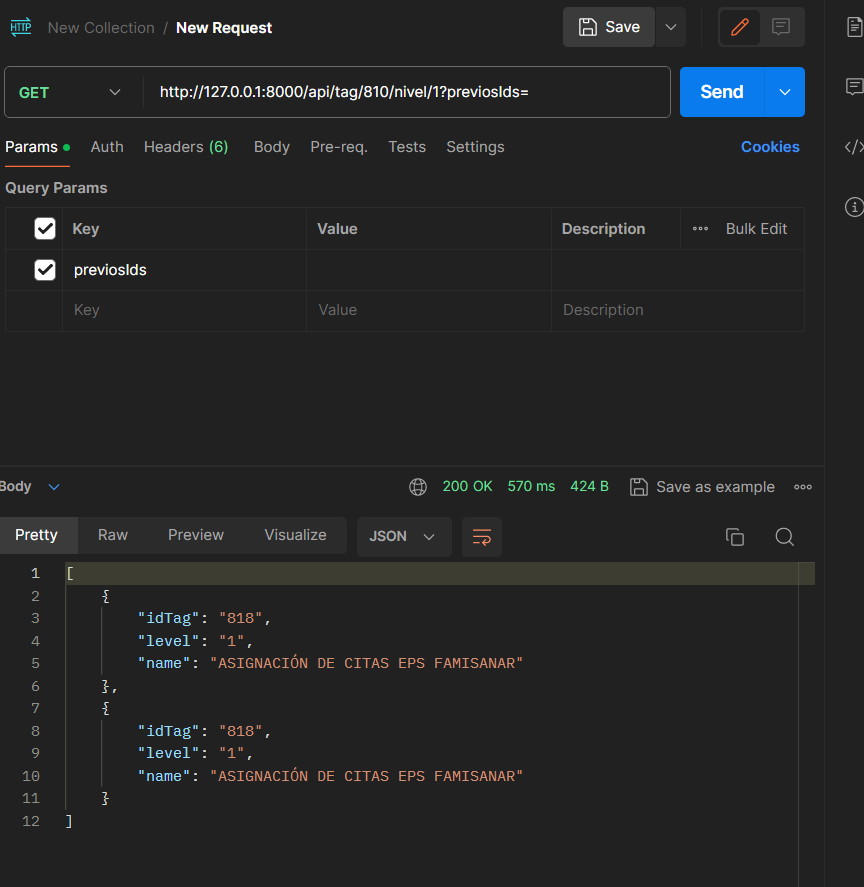
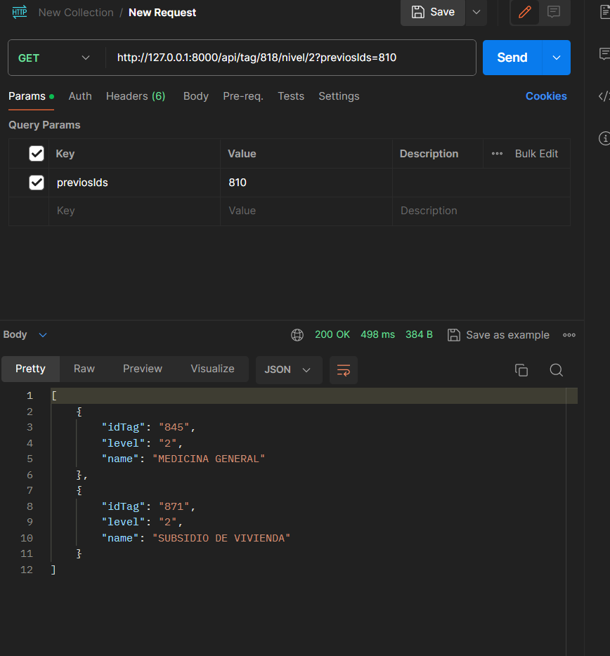
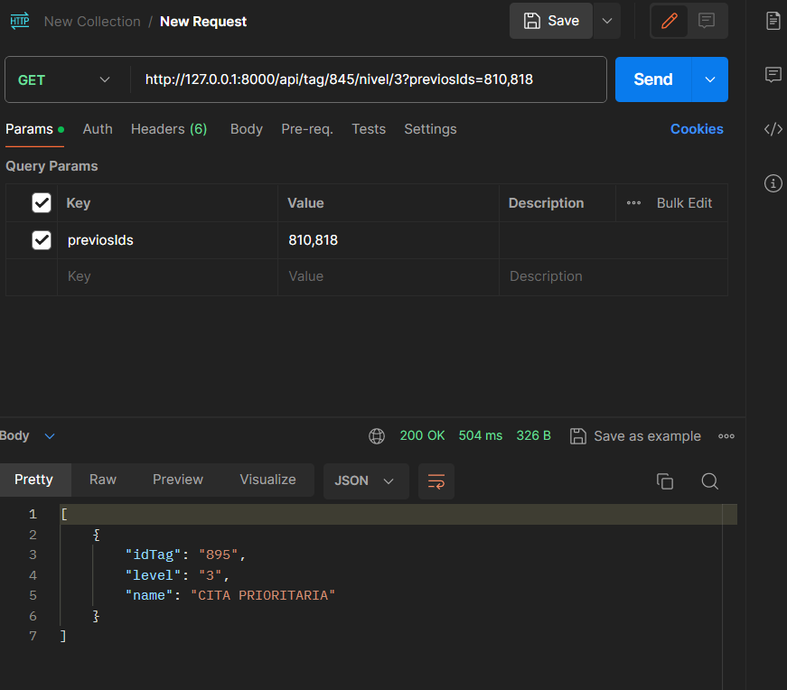
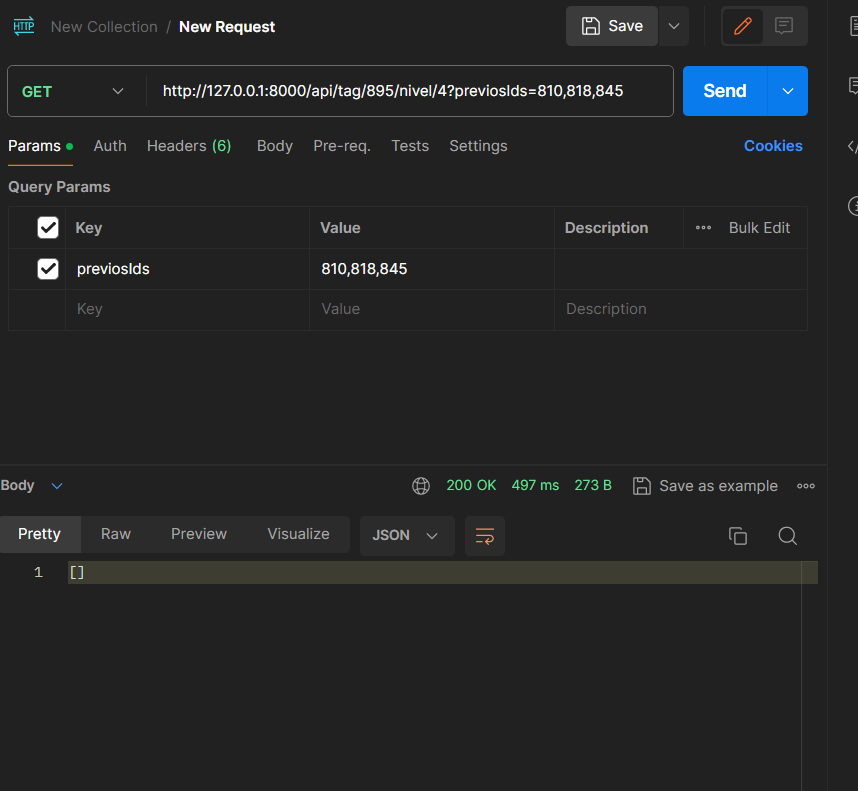

# Backend Tags

### Enpoint:

`http://127.0.0.1:8000/api/tag/810/nivel/1?previosIds=`

Se debe pasar como parametro el idTag del tag luego el nivel, en previosIds se colocan los idTag de los niveles anteriores:


```json

  http://127.0.0.1:8000/api/tag/810/nivel/1?previosIds=

```
```json

  http://127.0.0.1:8000/api/tag/818/nivel/2?previosIds=810

```
```json

  http://127.0.0.1:8000/api/tag/845/nivel/3?previosIds=810,818

```
```json

  http://127.0.0.1:8000/api/tag/895/nivel/4?previosIds=810,818,845

```
nivel 1

nivel 2

nivel 3

nivel 4

